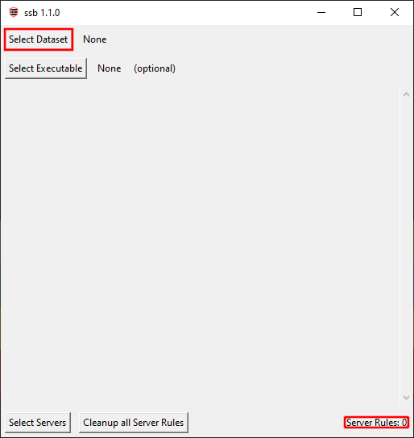
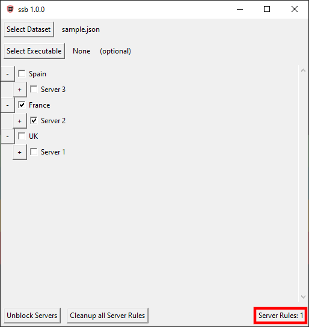

# ssb
**simple server blocker** - A simple desktop tool built generate and apply outbound firewall rules based on a dataset of IP addresses.

## How to Use

1. **Load a dataset**

    Select a JSON file containing categorized server/IP data.

2. **(Optional) Select an executable**

   Choose a program if you want the firewall rules to apply only to a specific application, if left empty, rules will apply system-wide.

3. **Select what to block**

4. **Apply the rules**
   Click **`Block Servers`**
   
    → The app will automatically:

   * Collect all relevant IPs from your selection
   * Generate the necessary firewall rules
   * Apply them to your system

5. **Toggle rules on/off**
   The button will switch to **`Unblock Servers`**, allowing you to quickly remove the applied rules.

6. **Clean up all server rules**
   Click **`Cleanup all Server Rules`** to remove all rules created by the tool.

7. **Monitor active rules**
   The UI displays the number of currently active custom firewall rules.

## Dataset Samples
<a href="https://pastebin.com/mgWsNpxx">https://pastebin.com/mgWsNpxx</a>

<a href="https://pastebin.com/hs1xSi1P">https://pastebin.com/hs1xSi1P</a>
## Build
Make sure you have  installed on your system.
### 1. Install PyInstaller

```bat
pip install pyinstaller
```

---

### 2. Run the build script

```bat
build.bat
```

---

### 3. Output

```text
dist\
└── main.exe
```

## Screenshots


## Donate
Donate to support me and my projects

| [](https://paypal.me/raafaa99) |  |  |
| :---: | :---: | :---: |
| PayPal | Bitcoin | Monero |
| [raafaa99](https://paypal.me/raafaa99) | 1MvzcDqAVfuQLYZKNCcBoVNYe2neta3pkM | 4254FmcCGBNbaq9CcqkUSk8eY3cqACjrGXRWkxXxXbjD1Up3Nu4BsCA1YCkrnrzG4SUmwDJQnBYJoeLrucWSDRhyRchRAHP |


## License
[](https://www.gnu.org/licenses/gpl-3.0.en.html)  

ssb is Free Software: You can use, study, share, and improve it at will. Specifically you can redistribute and/or modify it under the terms of the [GNU General Public License](https://www.gnu.org/licenses/gpl.html) as published by the Free Software Foundation, either version 3 of the License, or (at your option) any later version.
